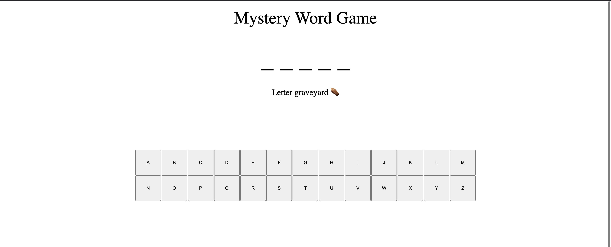
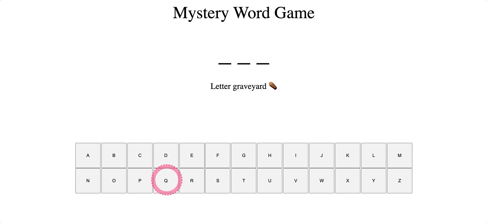

# Mystery Word

In this assignment you will build a word guessing game using HTML, CSS and JS DOM manipulation. You will get a random array of words from `words.js` , an included JavaScript file. You are welcome to add your own words or use a different list of words if you wish.

Screenshot:

In action :

## Features

A user will see a sqeuence of underscores in the place of the mystery word.

A user can guess up to five times before the game ends. Remind the user of how many guesses they have left.

A user loses a guess only if they guess incorrectly! If they guess a letter that is in the mystery word, they do no t lose a guess.

If a user guesses incorrectly, show the letter that the user guessed on screen and disable the corresponding button.

When a game ends, ask the user if they would like to play again. The game begins again if the user replies positively.

## 🌶 Spicy  Features

Allow the user to choose a difficulty based on word length. (i.e, 3 - 4 letter words are easy, 5 - 7 letter words are medium, 8+ letter words are hard)

Play an audio file when the user wins or loses. (You can find a database of sounds in different formats here: [bigsoundbank.com](https://bigsoundbank.com/))

For every incorrect guess, spell out the word "Mystery". Once the user has spelled out the full word "Mystery", the game ends and the user is prompted to play again.
